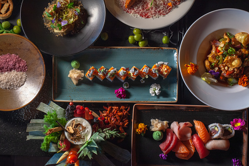

# -SQL-_PROJECT1

## Introduction
Danny seriously loves Japanese food so in the beginning of 2021, he decides to embark upon a risky venture and opens up a cute little restaurant that sells his 3 favourite foods: sushi, curry and ramen.

I was been able to perform Descriptive Analysis and provide answers to  Danny's Analytical questions,Using the company's Data,The tool used for this project is POSTGRES-SQL,it's Helps me in Optimizing the use of SQL CLAUSES such as WHERE,LIMIT,ORDER BY,GROUP BY,JOINS,SUBQUERY,WINDOW's FUNCTION,CTE

## Problem statement

Danny wants to use the data to answer a few simple questions about his customers, especially about their visiting patterns, how much money they’ve spent and also which menu items are their favourite. Having this deeper connection with his customers will help him deliver a better and more personalised experience for his loyal customers.

He plans on using these insights to help him decide whether he should expand the existing customer loyalty program

## Skills demonstrtated
 WHERE,LIMIT,ORDER BY,GROUP BY,JOINS,SUBQUERY,WINDOW's FUNCTION,CTE

## Data sourcing
This Data was gotten from this 👉 [LINK](https://8weeksqlchallenge.com/case-study-1/)
### Data transforming

### Modelling

### Analysis& visualization
Dashboard 1: Customer's Report |
:-------------:|

Dashboard 2: Item's Report 
:-------------:|

### Conclusion and recomendation
